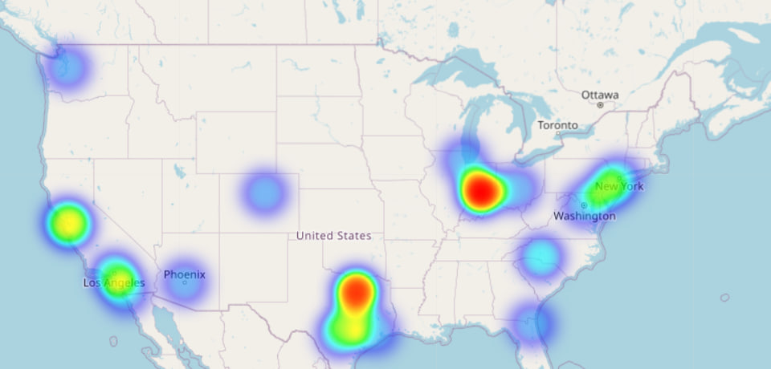

# Weather-Sensitive Sales Modeling for Forecast NOW Hackathon

**Forecast NOW!** — программа для автозаказа, оптимизации запасов и прогнозирования спроса. Специализируется на одном продукте, что позволяет глубоко исследовать и совершенствовать методы управления запасами и моделирования спроса.

---

## Цель проекта

Разработать модель, которая оценивает влияние погодных условий (температура, осадки) на продажи товаров в конкретных локациях. В результате для каждого товара формируется система коэффициентов, корректирующих прогноз спроса в зависимости от прогноза погоды на предстоящие периоды.

## Данные

* **train.csv** — исторические продажи (`date`, `store_nbr`, `item_nbr`, `units`).
* **weather.csv** — погодные данные по станциям (`tmax`, `tmin`, `tavg`, `preciptotal`, и др.).
* **key.csv** — соответствие `store_nbr` ↔ `station_nbr`.
* **test.csv** — данные для прогнозирования.

---

## Основные этапы работы

### 1. Загрузка и объединение данных

* Загружены и объединены данные из `train.csv`, `weather_by_city.csv`, `key.csv` и `store_city_coordinates.csv`

* Для ускорения прототипа выбрано 20 репрезентативных магазинов

* Создан уникальный идентификатор `(store_nbr + item_nbr)` для каждой позиции

* Проведено объединение погодных данных с продажами по ключу `date + city`

* Типизация данных и очистка городов (нижний регистр, trim)

### 2. Очистка и предобработка

* Заполнены пропуски `avg_temp_c` и `precipitation_mm` по среднему значению по городу

* Преобразование `units → log_units` для стабилизации модел

* Кодирование категориальных признаков (`city`,`unique_id`) через `LabelEncoder`

* Поиск выбросов через Z-score:

  * экстремумы `> 1000` удалены

  * выбросы заменены медианой по паре `store_nbr + item_nbr`

* Сохранены очищенные версии датасетов на каждом этапе

### 3. Feature Engineering

* Извлечены временные признаки: `year`, `month`, `day`, `weekend`, `season`, `holiday`

* Добавлен бинарный признак `sale = 1 if units > 0 else 0`

* Расчёт фичей спроса:

  * средние продажи по товару, магазину, паре `store+item`

  * скользящие средние (7 и 30 дней)

  * количество дней с последней продажи

* Применено one-hot-кодирование `season`

### 4. Анализ и визуализация (EDA)

* Boxplot и распределения погодных данных + выбросов

* Корреляционная тепловая карта между всеми числовыми переменными (погода, продажи, идентификаторы).

* Анализ распределения продаж по `item_nbr` и `store_nbr` с помощью countplot.

* Тепловая карта продаж по координатам магазинов (Folium + Heatmap).

* Выявление мультиколлинеарности (VIF-анализ).

### 5. Кластеризация

* Агрегация продаж по неделям и item’ам

* Масштабирование временных рядов

* Кластеризация товаров методом `KMeans` (10 кластеров)

* Присвоение товарной категории как нового признака `category`


### 6. Моделирование

* **Классификация** (`sale`):

  * Обучены модели:

    * `LRandomForestClassifier` — оценка важности признаков

    * `LogisticRegression` с `RandomizedSearchCV`

  * Выведены метрики: `F1`, `ROC-AUC`, `ROC-кривая`

* **Регрессия** (`units` при `sale==1`):

  * Обучен `LGBMRegressor` (с подбором гиперпараметров)

  * Коэффициенты влияния погоды оценены с помощью `Lasso`

  * Введена корректировка прогноза по температуре и осадкам

  * RMSE до и после погодной корректировки

### 7. Визуализация на карте

* Сгруппированы продажи по координатам магазинов

* Построена интерактивная тепловая карта с `Folium + HeatMap`

* Сохранена в HTML-файл `(store_heatmap.html)`

---

## Визуализация продаж на карте

Одним из ключевых результатов проекта стала **интерактивная тепловая карта**, отображающая плотность продаж по географическим координатам магазинов. Она позволяет наглядно увидеть, в каких регионах зафиксированы наибольшие объёмы продаж.

Карта построена с помощью библиотеки **Folium**, на основе агрегированных данных по `latitude`, `longitude` и `units`.




> *На карте интенсивность цвета указывает на общее количество продаж в данной точке. Центр карты — средняя геопозиция всех магазинов.*

HTML-версия доступна для интерактивного просмотра:  
[Открыть store_heatmap.html](https://sales-heatmap-j3ws.vercel.app/)

---

## Навыки

* Статистика и методы регрессии
* Работа с временными рядами (Pandas)
* Инженерия признаков и агрегирование по временным/географическим данным
* Python (scikit‑learn, statsmodels) и визуализация (Matplotlib, Seaborn, Plotly)

## Критерии оценивания

1. **Точность и адекватность** модели: качество прогноза при учёте погоды.
2. **Гибкость**: возможность применения в разных регионах/товарах/периодах.
3. **Интерпретируемость**: понятные коэффициенты и отчёты.
4. **Визуализация**: наглядные графики и дашборды.
5. **Качество кода и документации**: чистота, структурированность, комментарии.

---

## Структура репозитория

```


├── data/                  # Датасеты
│   ├── train.csv
│   ├── test.csv
│   ├── weather.csv
│   ├── key.csv
│   └── store_city_coordinates.csv
├── src/
│   ├── __init__.py              
│   ├── preprocess.py          # Подготовка данных       
│   ├── feature_engineering.py # Генерация признаков 
│   ├── data_stat.py           # Дополнительные статистики      
│   ├── clustering.py          # Кластеризация данных      
│   ├── lasso.py               # Создание регулязатора
│   ├── modeling.py            # Моделирование классификатора и регрессора
│   └── viz_map.py
├── notebooks/             # Jupyter-ноутбуки
│   └── notebook.ipynb
├── README.md    
├── visualizations/        # Визуальный анализ
│   ├── store_heatmap.html
│   ├── screen_map.jpg
└── run_pipeline.py
```
          
---

## Команда проекта

|               | Участник             | Роли и задачи                                |
| ------------  | -------------------  | -------------------------------------------- |
| Teamlead      | Константин Агапов    | ML Engineering                               |
| ML Engineer   | Сергей Зинкин        | EDA, ML Engineering                          |
| ML Engineer   | Маргарита Баландина  | EDA, Data Proprocessing, ML Engineering      |
| Data Analyst  | Фадеичев Даниил      | EDA, Data Proprocessin                       |
| Data Analyst  | Лаврухина Виктория   | EDA, Data Proprocessing                      |

---
**Начало работы:**

```bash
git clone git@github.com:LavrukhinaV/hackathon-forecast-now.git
cd hackathon-forecast-now
```

Открыть ноутбук `notebook.ipynb` в `notebooks/` и следовать порядку выполнения (самый лучший и наглядный вариант).

Либо же
1. Установить зависимости:
   ```bash
   conda env create -f environment.yml
   conda activate forecast-now
2. Убедиться, что все CSV-файлы лежат в папке data/.
3. Запустить сборочный скрипт:
   python run_pipeline.py

---


